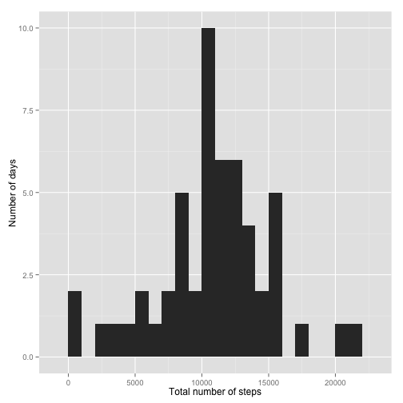
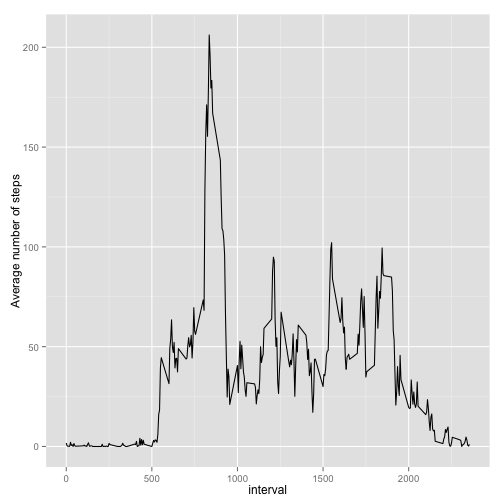
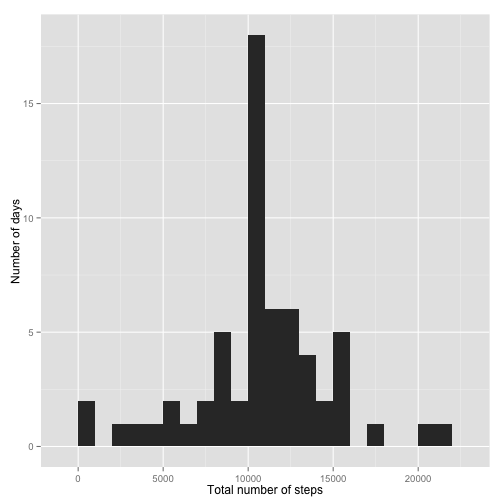
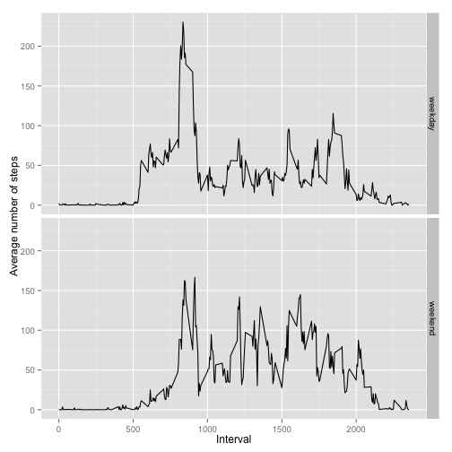

Reproducible Research: Peer Assessment 1  
==========================================================================
<br>

## Overview of the input data  
This assignment makes use of data from a personal activity monitoring device, 
which collected the data from anonymous individuals at 5 minute intervals 
throughout the day. The input data used for this analysis contains activity 
data collected during a two month period (from October to November, 2012) from 
a single individual and includes the number of steps taken during every 5-minute 
interval each day.  

## Variables in the input dataset  
* steps - number of steps taken during a 5-minute interval  
* date - the date on which the measurement was taken  
* interval - identifier for the 5-minute interval in which the measurement was 
taken  

## Additional information about the input data  
* missing values are coded as NA  
* there are a total of 17,568 observations  
* the unzipped input data ("activity.zip") can be found in this assignment's 
GitHub repository and should be placed into working directory  
<br>  

## Analysis of the input activity data  
Packages required for the analysis (ggplot2, plyr, and dplyr) are loaded into R  

```r
library(ggplot2)
library(plyr)
library(dplyr)
```
<br>  

### **A) Loading and preprocessing the data**
The unzipped data file (stored under a variable name 'zipFileName') in the 
working directory is extracted into the same directory

```r
zipFileName <- "activity.zip"
unzip(zipFileName)
```

The extracted data file (stored under a variable name 'fileName') is loaded into 
R in a table format

```r
fileName <- "activity.csv"
activityData <- read.csv(fileName, colClasses = c("integer", "Date", "integer"))
```
<br>  

### **B) What is the mean total number of steps taken per day?**
Calculating the sum of steps taken per day (missing values are ignored)

```r
totalsteps <- ddply(activityData, .(date), summarise, sum=sum(steps))
```

Creating a frequency histogram of total number of steps taken per day 
(missing values are ignored)

```r
qplot(sum, data = totalsteps, binwidth = 1000, xlab = "Total number of steps", 
      ylab = "Number of days")
```

 

Calculating the mean and median of total number of steps taken per day 
(missing values are ignored)

```r
meantotalsteps <- mean(totalsteps$sum, na.rm = TRUE)
mediantotalsteps <- median(totalsteps$sum, na.rm = TRUE)
```
**The average number of steps taken per day is 1.0766189 &times; 10<sup>4</sup>**  
**The median number of steps taken per day is 10765**  
<br>

### **C) What is the average daily activity pattern?**
Calculating the the average number of steps taken per 5-minute interval 
(missing values are ignored)

```r
averagesteps <- ddply(activityData, .(interval), summarise, 
                      average=mean(steps, na.rm = TRUE))
```

Creating a time series plot of average number of steps taken per 5-minute 
interval

```r
ggplot(averagesteps, aes(x = interval, y = average, group = 1)) + 
    geom_line() + labs(x = "Interval", y = "Average number of steps")
```

 

Determing the maximum of average steps taken per 5-minute interval

```r
maximumvalue <- max(averagesteps$average)
```

Identifying the 5-minute interval when the most steps were taken on average 
across the time period

```r
maxinterval <- averagesteps[(averagesteps$average==maximumvalue), 1]
```
**The maximum number of steps (on average across all the days) were taken at a 5-minute time interval of 835**  
<br>

### **D) Imputing missing values**
Calculating the total number of missing values in the dataset

```r
missingvaluestotal <- sum(is.na(activityData$steps))
```
**A total of 2304 values are missing in this dataset**  
<br>  

Creating a copy of the original dataset called 'imputedData', where missing values will be 
replaced with the mean number of steps taken during the same 5-minute interval, 
averaged across all days

```r
imputedData <- activityData
for (row in 1:nrow(imputedData)) {
    if (is.na(imputedData$steps[row]) == TRUE) {
        imputedData$steps[row] <- round(averagesteps[(averagesteps$interval == 
                                                             imputedData$interval[row]), 2])
    }
}
```

Calculating the sum of steps taken per day (with imputed values)

```r
totalstepsimputed <- ddply(imputedData, .(date), summarise, sum=sum(steps)) 
```

Creating a frequency histogram of total number of steps taken per day 
(with imputed values)

```r
qplot(sum, data = totalstepsimputed, binwidth = 1000, xlab = "Total number of steps", 
      ylab = "Number of days")
```

 

Calculating the mean and median of total number of steps taken per day (with 
imputed values)

```r
meantotalstepsimputed <- mean(totalstepsimputed$sum)
mediantotalstepsimputed <- median(totalstepsimputed$sum)
```
**The average number of steps taken per day (considering the missing values have been replaced) is 1.0765639 &times; 10<sup>4</sup>**  
**The median number of steps taken per day (considering the missing values have been replaced) is 1.0762 &times; 10<sup>4</sup>**  
<br>

**Please note, replacing the missing values decreases these results indicating that the original values were biased**  
<br>

### **E) Are there differences in activity patterns between weekdays and weekends?**

Creating a new factor variable called 'timeofweek' with two levels ('weekday' 
and 'weekend') into the imputed activity dataset.  
First, this 'timeofweek' variable will report an abbreviated version of the 
weekday ('Mon' to 'Sun') on which the measurement was taken. Afterwards, this 
abbreviated version of the weekday will be replaced with 'weekend' if the 
abbreviated day is 'Sat' or 'Sun', or with 'weekday' for the rest of the days 
of the week.   

```r
imputedData <- mutate(imputedData, timeofweek = weekdays(date, abbreviate = TRUE))
for (row in 1:nrow(imputedData)) {
    if (imputedData$timeofweek[row] %in% c("Sat", "Sun")) {
        imputedData$timeofweek[row] <- "weekend"
    } else {
        imputedData$timeofweek[row] <- "weekday"
    }
}
imputedData$timeofweek <- as.factor(imputedData$timeofweek)
```
Creating a panel plot containing two time series plots of average number 
of steps taken per 5-minute interval (averaged across weekday or weekend days) 

```r
averagestepsimputed <- ddply(imputedData, .(interval, timeofweek), summarise, average=mean(steps))
ggplot(averagestepsimputed, aes(x = interval, y = average)) + 
    geom_line() + labs(x = "Interval", y = "Average number of steps") + 
    facet_grid(timeofweek ~ .)
```

 
